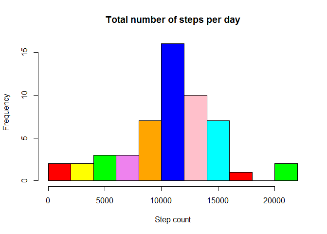
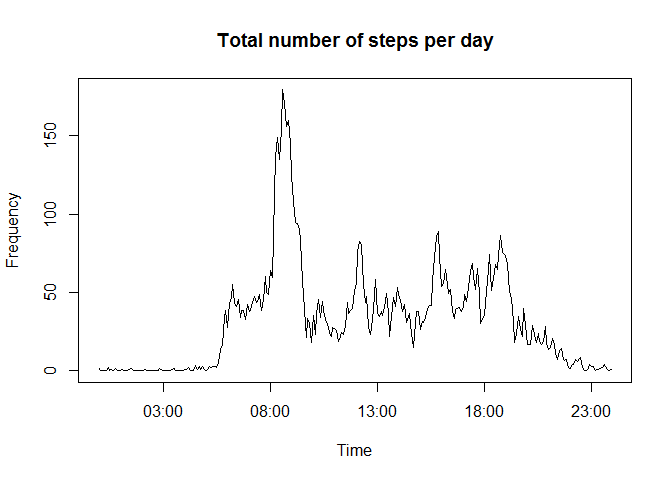
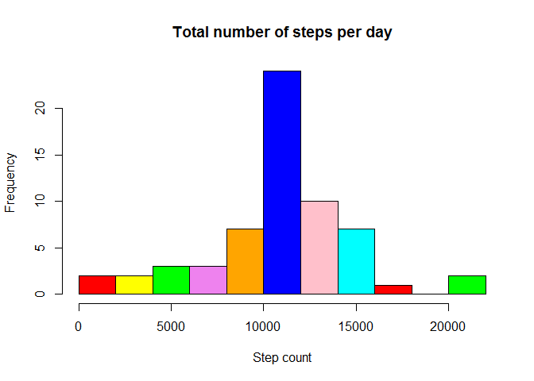
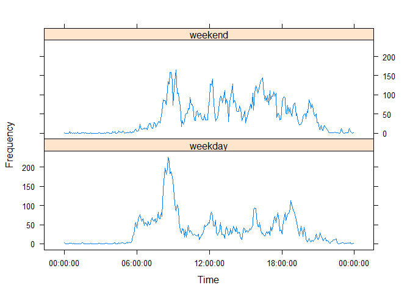

# Reproducible Research: Peer Assessment 1


## Loading and preprocessing the data

```r
library(dplyr)
```

```
## 
## Attaching package: 'dplyr'
## 
## The following object is masked from 'package:stats':
## 
##     filter
## 
## The following objects are masked from 'package:base':
## 
##     intersect, setdiff, setequal, union
```

```r
library(plyr)
```

```
## -------------------------------------------------------------------------
## You have loaded plyr after dplyr - this is likely to cause problems.
## If you need functions from both plyr and dplyr, please load plyr first, then dplyr:
## library(plyr); library(dplyr)
## -------------------------------------------------------------------------
## 
## Attaching package: 'plyr'
## 
## The following objects are masked from 'package:dplyr':
## 
##     arrange, count, desc, failwith, id, mutate, rename, summarise,
##     summarize
```

```r
library(lattice)
options(scipen = 5, digits = 2)
Sys.setlocale("LC_TIME", "English")
```

```
## [1] "English_United States.1252"
```

```r
dfAx3dataRaw <- read.csv(unz("activity.zip", "activity.csv"), header=T,sep=",",stringsAsFactors=FALSE)
# Settings NAs to zero
dfAx3data <- dfAx3dataRaw
dfAx3data[is.na(dfAx3data[,"steps"]),"steps"] <- 0
# Converting the time intervals
#First convert to character and pad it with zeroes
dfAx3data$interval <- sprintf("%04d",as.numeric(dfAx3data$int))
strTimeFormat <- "%H%M"
#This method also adds a date, but this won't interfere in
#our analysis
dfAx3data$interval <- strptime(dfAx3data$interval,strTimeFormat)
# Show some head and tail of the data frame
head(dfAx3data)
```

```
##   steps       date            interval
## 1     0 2012-10-01 2014-12-13 00:00:00
## 2     0 2012-10-01 2014-12-13 00:05:00
## 3     0 2012-10-01 2014-12-13 00:10:00
## 4     0 2012-10-01 2014-12-13 00:15:00
## 5     0 2012-10-01 2014-12-13 00:20:00
## 6     0 2012-10-01 2014-12-13 00:25:00
```

```r
tail(dfAx3data)
```

```
##       steps       date            interval
## 17563     0 2012-11-30 2014-12-13 23:30:00
## 17564     0 2012-11-30 2014-12-13 23:35:00
## 17565     0 2012-11-30 2014-12-13 23:40:00
## 17566     0 2012-11-30 2014-12-13 23:45:00
## 17567     0 2012-11-30 2014-12-13 23:50:00
## 17568     0 2012-11-30 2014-12-13 23:55:00
```
## What is mean total number of steps taken per day?
1. Make a histogram of the total number of steps taken each day

```r
colors = c("red", "yellow", "green",
           "violet", "orange","blue", "pink", "cyan")
with(ddply(dfAx3data,
      "date",
      summarise,
      total=sum(steps)),
hist(total,
     breaks = 10,
     main = "Total number of steps per day",
     xlab = "Step count",
     ylab = "Frequency",
     col=colors))
```

 

2. Calculate and report the mean and median total number of steps taken per day

```r
dfAx2doTotalPerDate <- ddply(dfAx3data, .(date), summarise, total = sum(steps,na.rm=TRUE))
lsAdoTotalPerDate <- dfAx2doTotalPerDate$total
doMean <-  mean(lsAdoTotalPerDate)
doMedian <- median(lsAdoTotalPerDate)
```

The mean of the total number of steps per day is 9354.23.  
The median of the total number of steps per day is 10395.

## What is the average daily activity pattern?
1.  Make a time series plot (i.e. type = "l") of the 5-minute interval (x-axis) and the average number of steps taken, averaged across all days (y-axis).  

```r
dfAx2doIntervalMean <- ddply(dfAx3data, .(interval), summarise, mean = mean(steps,na.rm = TRUE))
with(dfAx2doIntervalMean,
     plot(x = interval,
          y = mean,
          type = "l",
          main = "Total number of steps per day",
          xlab = "Time",
          ylab = "Frequency"))
```

 

2. Which 5-minute interval, on average across all the days in the dataset, contains the maximum number of steps?

```r
dtMaxInterval <- dfAx2doIntervalMean[dfAx2doIntervalMean$mean==max(dfAx2doIntervalMean$mean),"interval"]
strMaxInterval <- format(dtMaxInterval,"%H:%M")
```

On average, the maximum number of steps occurs at 08:35.

## Imputing missing values

Note that there are a number of days/intervals where there are missing values (coded as NA). The presence of missing days may introduce bias into some calculations or summaries of the data.

1. Calculate and report the total number of missing values in the dataset (i.e. the total number of rows with NAs)

```r
inMissingValue <- sum(is.na(dfAx3dataRaw$steps))
```

The total number of missing values is 2304.

2. Devise a strategy for filling in all of the missing values in the dataset. The strategy does not need to be sophisticated. For example, you could use the mean/median for that day, or the mean for that 5-minute interval, etc.
The strategy I use, is to replace the missing steps values by the mean (over all samples) for the 5 minute interval.


3. Create a new dataset that is equal to the original dataset but with the missing data filled in.

```r
dfAx2strdoIntervalMean <- ddply(dfAx3data,
      .(interval),
      summarise,
      mean = mean(steps,na.rm=TRUE))
lsABooIsNA <- is.na(dfAx3dataRaw[,"steps"])
dfAx3dataFilled <- dfAx3data
for( inIndexInterval in 1:length(dfAx2strdoIntervalMean[,1]) ){
    strInterval <- dfAx2strdoIntervalMean[inIndexInterval,"interval"]
    doMeanFiller <- dfAx2strdoIntervalMean[inIndexInterval,"mean"]
    dfAx3dataFilled[dfAx3dataFilled[,"interval"] == strInterval & lsABooIsNA,"steps"] <- doMeanFiller
}
head(dfAx3dataFilled)
```

```
##   steps       date            interval
## 1 1.492 2012-10-01 2014-12-13 00:00:00
## 2 0.295 2012-10-01 2014-12-13 00:05:00
## 3 0.115 2012-10-01 2014-12-13 00:10:00
## 4 0.131 2012-10-01 2014-12-13 00:15:00
## 5 0.066 2012-10-01 2014-12-13 00:20:00
## 6 1.820 2012-10-01 2014-12-13 00:25:00
```

4. Make a histogram of the total number of steps taken each day and Calculate and report the mean and median total number of steps taken per day.

```r
colors = c("red", "yellow", "green",
           "violet", "orange","blue", "pink", "cyan")
with(ddply(dfAx3dataFilled,
      "date",
      summarise,
      total = sum(steps)),
hist(total,
     breaks = 10,
     main = "Total number of steps per day",
     xlab = "Step count",
     ylab = "Frequency",
     col=colors))
```

 

```r
dfAx2doTotalPerDateFilled <- ddply(dfAx3dataFilled, .(date), summarise, total = sum(steps,na.rm=TRUE))
lsAdoTotalPerDateFilled <- dfAx2doTotalPerDateFilled$total
doMeanFilled <- mean(lsAdoTotalPerDateFilled)
doMedianFilled <- median(lsAdoTotalPerDateFilled)
```

The mean of the total number of steps per day for the filled in dataset is
10581.01, wheras the median of the total number of steps per day is
10395.

5. Do these values differ from the estimates from the first part of the assignment?

The mean is different from the first part of the assignment, the median not.
The absolute difference in the mean is 1226.78.

6. What is the impact of imputing missing data on the estimates of the total daily number of steps?
The mean increases, the median stays the same.
Replacing the values also seems to normalize the total number of steps per day frequency vs step count.

## Are there differences in activity patterns between weekdays and weekends?

1. For this part the weekdays() function may be of some help here. Use the dataset with the filled-in missing values for this part. Create a new factor variable in the dataset with two levels - "weekday" and "weekend" indicating whether a given date is a weekday or weekend day.


```r
dfAx3dodtdtFilled <- dfAx3dataFilled
strFormatTime2 <- "%Y-%m-%d"
dfAx3dodtdtFilled <- mutate(dfAx3dodtdtFilled,
  date = strptime(date,strFormatTime2),
  weekdayend = factor(ifelse( substr(weekdays(date),1,1)=="S", "weekend", "weekday"))
  )
```


2. Make a panel plot containing a time series plot (i.e. type = "l") of the 5-minute interval (x-axis) and the average number of steps taken, averaged across all weekday days or weekend days (y-axis).


```r
dfAx3strdtdoSummary <- ddply(dfAx3dodtdtFilled,
      c("weekdayend","interval"),
      summarise,
      mean=mean(steps))
# Convert time format
dfAx3strdtdoSummary$interval <- as.POSIXct(dfAx3strdtdoSummary$interval)
xyplot(mean ~ interval | weekdayend,
       type = "l",
       data = dfAx3strdtdoSummary,
       layout = c(1,2),
       xlab = "Time",
       ylab = "Frequency",
       scales = list(format="%H:%M:%S"))
```

 
